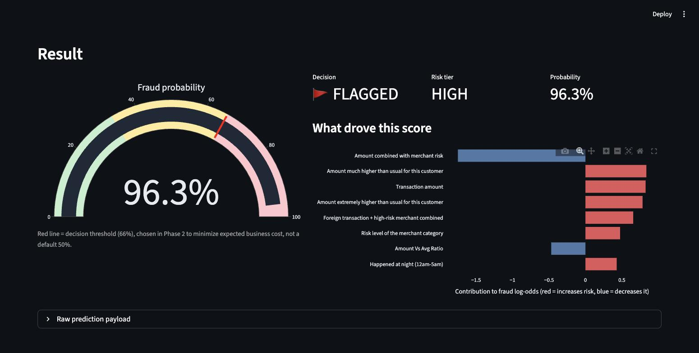
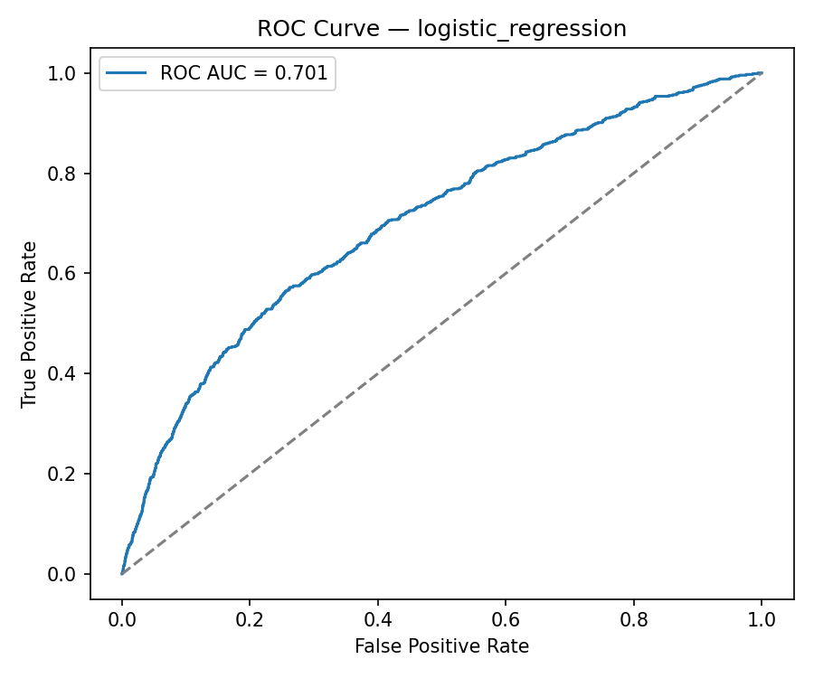
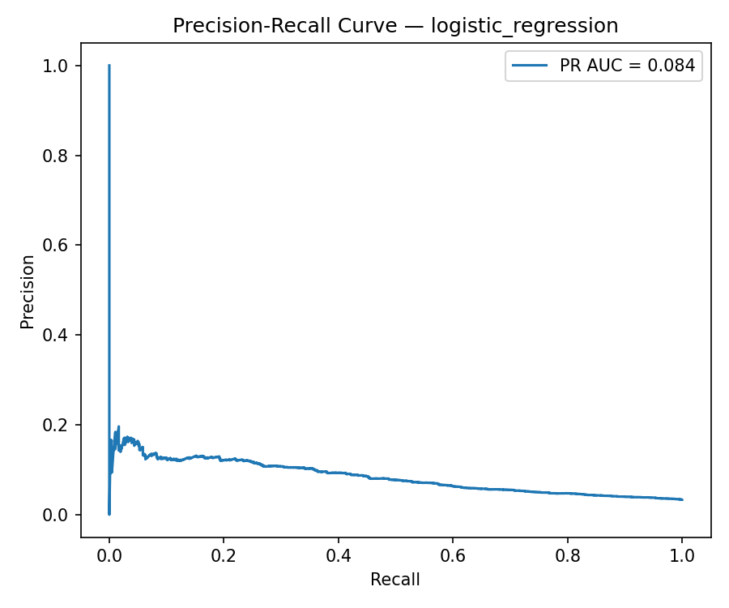
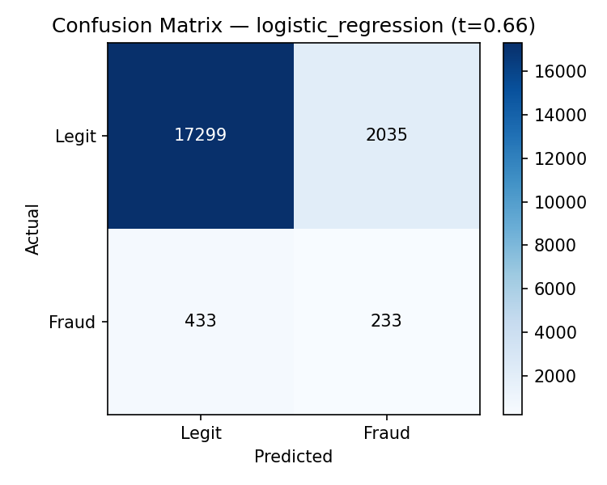

# 🛡️ FinShield — Fraud Detection Platform

An end-to-end fraud detection system for card and digital payment transactions: synthetic data generation → feature engineering → model comparison & tuning → **business-cost-driven decision threshold** → real-time inference API → interactive demo. Built as a portfolio project, engineered like a production one.

**🔗 Live API:** [finshield-fraud-detection-platform.onrender.com/docs](https://finshield-fraud-detection-platform.onrender.com/docs) *(free tier — the first request after a period of inactivity can take 30-50s to wake it up)*

> **TL;DR:** Trained and compared 4 models on 100,000 simulated transactions. The winner (Logistic Regression) isn't the fanciest model — it's the one that matches how the data was actually generated, and it's proven with cross-validation, not guessed. Instead of the default 50% cutoff, the decision threshold was chosen to minimize *estimated dollar cost*, cutting expected fraud-related losses by **~22% vs. taking no action at all**. Full reasoning in [`outputs/reports/final_report.md`](outputs/reports/final_report.md) and [`notebooks/03_modeling.ipynb`](notebooks/03_modeling.ipynb).

---

## Demo



Run it yourself: `streamlit run streamlit_app.py` — pick a preset transaction (or fill in your own), and see the fraud probability, the flag decision, and *which signals drove it*, live.

---

## Results at a glance

| | |
|---|---|
| **Dataset** | 100,000 simulated transactions, 5,000 customers, ~3.3% fraud rate |
| **Models compared** | Dummy (baseline), Logistic Regression, Random Forest, HistGradientBoosting — 5-fold stratified cross-validation |
| **Winning model** | Logistic Regression (PR AUC 0.095 ± 0.010 CV, ROC AUC 0.713) |
| **Decision threshold** | 0.66, chosen to minimize estimated business cost — not the default 0.5 |
| **Estimated impact** | ~22% reduction in expected fraud-related cost vs. no model |
| **Tests** | 24 passing (`pytest`) |

*Why Logistic Regression won over more complex models, why PR AUC ≈ 0.10 is actually reasonable here (not a bug), and the full cost-vs-threshold analysis are explained in detail in [`notebooks/03_modeling.ipynb`](notebooks/03_modeling.ipynb) and [`outputs/reports/final_report.md`](outputs/reports/final_report.md).*

<p>
  
  
  
</p>

---

## Business problem

Fintech companies process thousands of card and digital-payment transactions daily. A fraud system has to catch fraud fast while minimizing friction for legitimate customers — every false alarm has a cost too. This project simulates that problem end to end: synthetic data with realistic (noisy, not artificially clean) fraud patterns, a model selected and evaluated the way a risk team actually would, and a decision threshold grounded in estimated dollar cost rather than a statistical default.

**Target:** `is_fraud` (binary) and `fraud_probability` (the model's estimated probability).

---

## Architecture — one pipeline, three consumers

The single most important design decision in this project: **feature engineering lives in exactly one place** (`src/feature_engineering.py::compute_risk_signals` and `create_features`), and everything downstream — synthetic label generation, model training, the notebooks, the API, and the Streamlit demo — calls into it instead of reimplementing it.

```text
src/data_generation.py  ──┐
                           ├──▶  src/feature_engineering.py   (single source of truth
notebooks/, src/train.py ─┤        compute_risk_signals()      for every feature)
                           │        create_features()
src/predict.py ───────────┘
        │
        ├──▶ api/main.py        (FastAPI: POST /predict)
        └──▶ streamlit_app.py   (interactive demo)
```

This matters in practice, not just in theory: earlier in this project, the risk-signal features were only computed inside the data simulator. A new transaction arriving without those pre-computed columns would have silently lost features instead of failing — a classic **train/serve skew** bug. It's fixed now: `get_modeling_data` raises immediately if an expected feature is missing, and `src/predict.py` (used by both the API and the demo) runs every transaction through the exact same `create_features` used at training time. See `notebooks/02_feature_engineering.ipynb`, section 5, for a live demonstration of both the bug and the fix.

---

## Project structure

```text
finshield-fraud-detection-platform/
│
├── data/
│   ├── data_dictionary.md        # every variable, explained, incl. what's excluded from training and why
│   ├── raw/                      # generated transactions.csv (gitignored, regenerate locally)
│   └── processed/
│
├── notebooks/                    # narrated walkthroughs — run top to bottom, real outputs included
│   ├── 01_data_simulation.ipynb
│   ├── 02_feature_engineering.ipynb
│   └── 03_modeling.ipynb         # model comparison, tuning, cost-based threshold, business case
│
├── src/
│   ├── data_generation.py        # synthetic customers + transactions + fraud labels
│   ├── feature_engineering.py    # compute_risk_signals(), create_features(), get_modeling_data()
│   ├── train.py                  # CV comparison, tuning, threshold selection, evaluation, reporting
│   ├── predict.py                # predict_one() / predict_batch() — used by the API and the demo
│   └── utils.py                  # PROJECT_ROOT resolution, logging, metadata loading
│
├── api/
│   └── main.py                   # FastAPI service: GET /health, POST /predict
│
├── streamlit_app.py              # interactive demo (form + gauge + per-prediction explanation)
│
├── models/                       # model.joblib + model_metadata.json are committed (see below)
├── outputs/
│   ├── figures/                  # ROC, PR, confusion matrix, feature importance (committed)
│   └── reports/                  # model comparison table, threshold analysis, business report
│
├── tests/                        # pytest — data generation, feature engineering, predict, API
├── requirements.txt              # pinned runtime dependencies
├── requirements-dev.txt          # + pytest, httpx (dev/test only)
└── pyproject.toml                # pytest config
```

**Note on `models/` and `outputs/`:** unlike a typical `.gitignore`d model directory, the trained `model.joblib`, its metadata, the figures, and the reports are **intentionally committed** — this is a portfolio repo, and a reviewer should be able to see the results (and run the API/demo) without retraining first. The large per-row prediction dump and the raw generated dataset are still gitignored (regenerable, not needed to review the project).

---

## Quickstart

```bash
git clone git@github.com:dacardonave/finshield-fraud-detection-platform.git
cd finshield-fraud-detection-platform
python -m venv .venv && source .venv/bin/activate      # or use conda
pip install -r requirements.txt
```

### Try the trained model right away (no retraining needed)

```bash
# Interactive demo, in your browser
streamlit run streamlit_app.py

# Or the REST API
uvicorn api.main:app --reload
# then open http://127.0.0.1:8000/docs
```

### Reproduce everything from scratch

```bash
python -m src.data_generation   # regenerate data/raw/transactions.csv
python -m src.train              # retrain, retune, re-evaluate, regenerate all figures/reports
pytest                           # 24 tests, ~2s
```

Or open the notebooks in order (`01` → `02` → `03`) for the full narrated walkthrough with the reasoning behind every decision.

### Or run it with Docker

Both the API and the Streamlit demo run from the same image (they share the same dependencies and the same trained model, so there's no reason to build two):

```bash
docker compose up --build
# API:  http://localhost:8000/docs
# Demo: http://localhost:8501
```

---

## API example

```bash
curl -X POST http://127.0.0.1:8000/predict \
  -H "Content-Type: application/json" \
  -d '{
    "transaction_type": "digital_payment", "merchant_category": "electronics",
    "transaction_amount": 900.0, "channel": "web", "device_type": "android",
    "transaction_city": "Miami", "merchant_risk_score": 0.9,
    "timestamp": "2025-06-15T02:30:00", "customer_home_city": "Brooklyn",
    "customer_tenure_days": 900, "account_age_days": 900,
    "preferred_device_type": "ios", "avg_amount_30d": 50.0, "std_amount_30d": 20.0,
    "transactions_last_7d": 5, "declines_last_30d": 0, "chargebacks_last_90d": 0
  }'
```

```json
{
  "fraud_probability": 0.963,
  "is_fraud": true,
  "risk_tier": "high",
  "decision_threshold": 0.66
}
```

Full interactive documentation (with a pre-filled example) is auto-generated at `/docs` once the server is running.

---

## Tech stack

Python · pandas · NumPy · scikit-learn · FastAPI · Streamlit · Plotly · Matplotlib · Jupyter · pytest · joblib

## Data dictionary

Every variable — including which ones are deliberately excluded from training and why (identifiers, raw timestamps, simulation-only leakage columns) — is documented in [`data/data_dictionary.md`](data/data_dictionary.md).

## Roadmap

- [x] Synthetic data generation with realistic, noisy fraud patterns
- [x] Feature engineering with a single shared source of truth (no train/serve skew)
- [x] Model comparison, tuning, and a business-cost-driven decision threshold
- [x] Real-time inference API (FastAPI)
- [x] Interactive demo (Streamlit)
- [x] Test suite (pytest)
- [x] Containerization (Docker)
- [x] CI (GitHub Actions)
- [x] Live deployment — API on Render (demo on Hugging Face Spaces coming next)

## License

[MIT](LICENSE)
